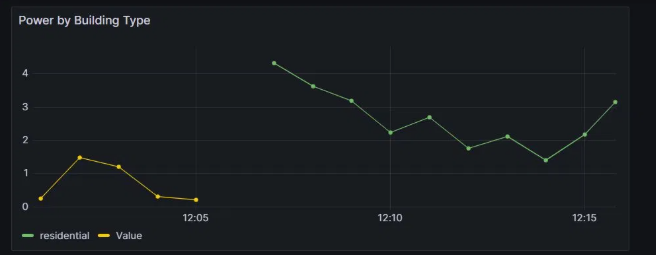
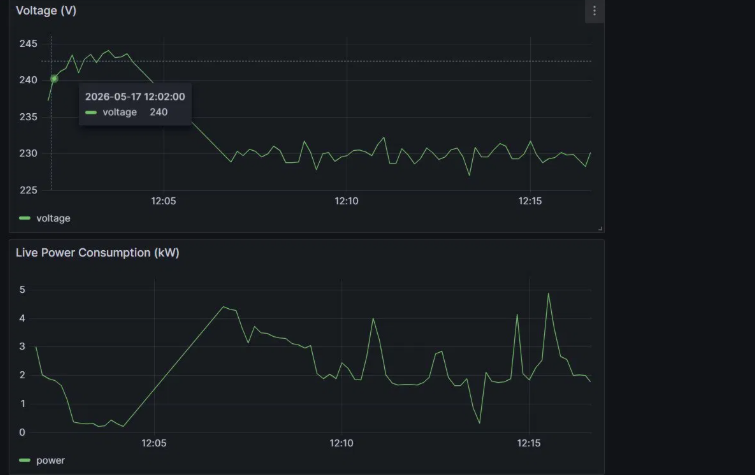
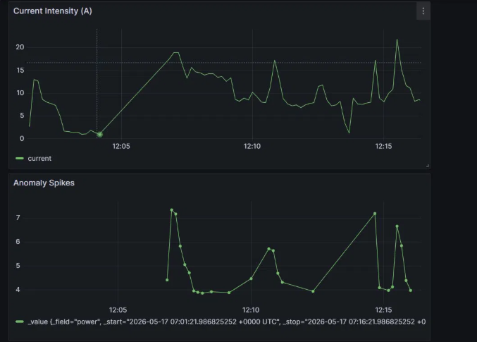
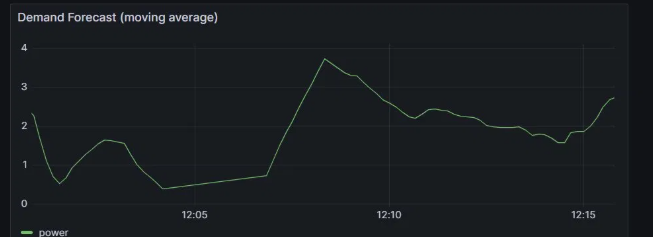
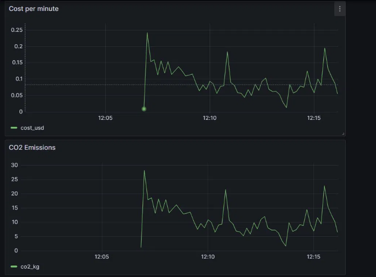

# ⚡ IoT Smart Grid Energy Monitoring System

A real-time energy monitoring system that simulates a smart grid with 25 meters across residential, commercial, and industrial buildings. Built with a full IoT-to-dashboard pipeline using industry-standard big data tools.



---

##  Live Dashboard

| Panel | Screenshot |
|---|---|
| Power & Voltage |  |
| Anomaly Detection |  |
| Forecast & Emissions |  |
| Cost & Building Type |  |

---

##  Architecture

```
Dataset (7.68 GB)
      ↓
MQTT Publisher        →   Mosquitto Broker (port 1883)
                                ↓
                      MQTT-Kafka Bridge
                                ↓
                      Apache Kafka (port 9092)
                                ↓
                      Apache Spark Streaming
                                ↓
                      InfluxDB (port 8086)
                                ↓
                      Grafana Dashboard (port 3000)
```

---

##  Dataset

**UCI Individual Household Electric Power Consumption** — expanded to simulate a full smart grid.

| Property | Value |
|---|---|
| File | `combined_energy_dataset.csv` |
| Size | **7.68 GB** |
| Rows | ~51 million readings |
| Smart Meters | 25 (meter_001 to meter_025) |
| Time Span | 4 years (minute-by-minute) |
| Building Types | Residential (230V) · Commercial (380V) · Industrial (415V) |

**20 Features:** `timestamp`, `power`, `voltage`, `current`, `reactive_power`, `apparent_power`, `power_factor`, `sub_meter_1/2/3`, `frequency`, `temperature_c`, `humidity_pct`, `anomaly`, `co2_kg`, `cost_usd`, `meter_id`, `building_type`, `tariff_zone`, `grid_region`

---

##  Tech Stack

| Technology | Role | Port |
|---|---|---|
| **Python** | Scripts & data simulation | — |
| **MQTT / Mosquitto** | IoT communication protocol | 1883 |
| **Apache Kafka** | High-speed stream pipeline | 9092 |
| **Apache Spark Streaming** | Real-time analytics & anomaly detection | — |
| **InfluxDB** | Time-series database | 8086 |
| **Grafana** | Live visualization dashboard | 3000 |
| **Docker** | Infrastructure orchestration | — |

---

##  Features

### Real-Time Monitoring
- Live power consumption (kW) updated every 5 seconds
- Voltage stability monitoring (V)
- Current intensity tracking (A)

### Anomaly Detection (3 Levels)
| Type | Condition |
|---|---|
| `critical_spike` | power > 15 kW |
| `high_consumption` | power > 7 kW |
| `statistical_outlier` | Top 3% of readings (97th percentile) |

### Demand Forecasting
- 10-point moving average over rolling 30-minute window
- Trend visualization for grid operators

### Additional Metrics
-  Energy cost per minute (USD)
-  CO₂ emissions per reading (kg)
-  Power breakdown by building type

---

##  Getting Started

### Prerequisites
- Python 3.10 or 3.11
- Java 11 (required for Spark) — [Download Temurin JDK 11](https://adoptium.net/temurin/releases/?version=11)
- Docker Desktop — [Download](https://docker.com/products/docker-desktop)
- Git

### 1. Clone the Repository
```bash
git clone https://github.com/YOUR_USERNAME/smart-grid-project.git
cd smart-grid-project
```

### 2. Download the Dataset
Download from [UCI Repository](https://archive.ics.uci.edu/dataset/235) and place in `data/`.

Then generate the full 7.68 GB smart grid dataset:
```bash
pip install -r requirements.txt
python scripts/combine_datasets.py
```
*(Takes ~3–4 minutes)*

### 3. Set Up Hadoop (Windows only — required for Spark)
```powershell
# Download winutils.exe + hadoop.dll from:
# https://github.com/cdarlint/winutils/tree/master/hadoop-3.3.5/bin
# Place both files in C:\hadoop\bin\

$env:HADOOP_HOME = "C:\hadoop"
$env:JAVA_HOME = "C:\Program Files\Eclipse Adoptium\jdk-11.x.x-hotspot"
$env:PYSPARK_PYTHON = "python"
$env:PYSPARK_DRIVER_PYTHON = "python"
```

### 4. Start Infrastructure
```bash
docker-compose up -d
```
Wait 30 seconds, then verify:
```bash
docker ps   # Should show 5 running containers
```

### 5. Run the Pipeline (4 terminals)

**Terminal 1 — MQTT Bridge:**
```bash
cd scripts
python mqtt_kafka_bridge.py
```

**Terminal 2 — Spark Streaming:**
```bash
cd scripts
python spark_streaming.py
```

**Terminal 3 — Smart Meter Simulator:**
```bash
cd scripts
python mqtt_publisher.py
```

### 6. Open Grafana
Go to **http://localhost:3000** → Login: `admin` / `admin`

Open the **Smart Grid Monitor** dashboard.

---

##  Project Structure

```
smart-grid-project/
├── data/
│   └── combined_energy_dataset.csv   # 7.68 GB (generated)
├── scripts/
│   ├── mqtt_publisher.py             # Smart meter simulator
│   ├── mqtt_kafka_bridge.py          # MQTT → Kafka forwarder
│   ├── spark_streaming.py            # Real-time analytics
│   └── combine_datasets.py           # Dataset builder
├── config/
│   └── mosquitto.conf                # MQTT broker config
├── screenshots/                      # Dashboard screenshots
├── docker-compose.yml                # Full infrastructure
├── requirements.txt                  # Python dependencies
└── README.md
```

---

##  Services & Credentials

| Service | URL | Credentials |
|---|---|---|
| Grafana | http://localhost:3000 | admin / admin |
| InfluxDB | http://localhost:8086 | admin / adminpass123 |
| Kafka | localhost:9092 | — |
| MQTT | localhost:1883 | — |

InfluxDB Token: `my-super-secret-token`
InfluxDB Org: `smartgrid` · Bucket: `energy`

---

##  Stopping the Project

```bash
# Stop Python scripts: Ctrl+C in each terminal

# Stop Docker containers
docker-compose down

# To pause (keeps InfluxDB data):
docker-compose stop
docker-compose start   # Resume later
```

---

## 📋 Requirements Met

| Requirement | Implementation |
|---|---|
| Dataset > 2 GB | 7.68 GB, 51M rows, 25 meters |
| MQTT Broker | Mosquitto on Docker |
| Apache Kafka | Confluent Kafka, topic: energy_stream |
| Apache Spark Streaming | Continuous micro-batch processing |
| InfluxDB | Time-series storage, bucket: energy |
| Grafana Dashboard | 8 live panels, 5s refresh |
| Real-time monitoring | Power, voltage, current live |
| Anomaly detection | 3-tier classification |
| Demand forecasting | 10-point moving average |

---
